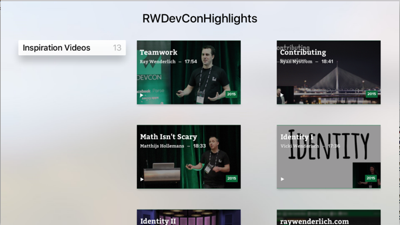

# tvOS-RayWenderlichDevCon

AppleTv Application that streams the catalog of the last of RWDevCon Conference



## Requirements
Build Requirements: Xcode 7.1, tvOS 9.0 SDK
Runtime Requirements: tvOS 9.0 or later

## Installation instructions:
To start a local server run the following command in a terminal within the 'client' folder to create a simple webserver.

```
python -m SimpleHTTPServer 9001
```
